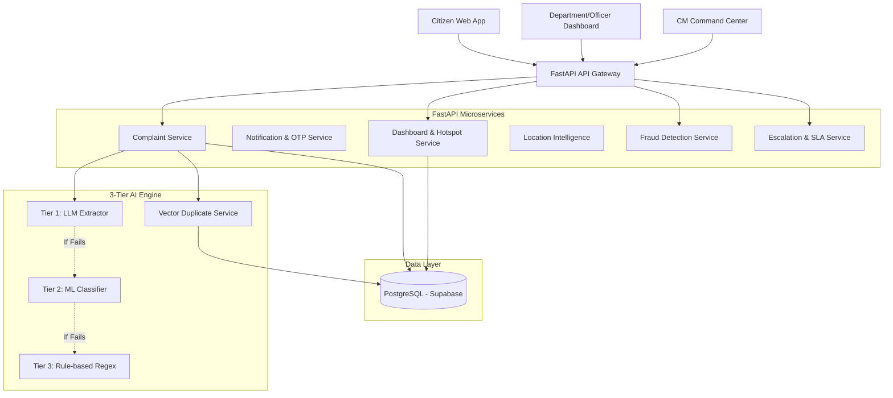
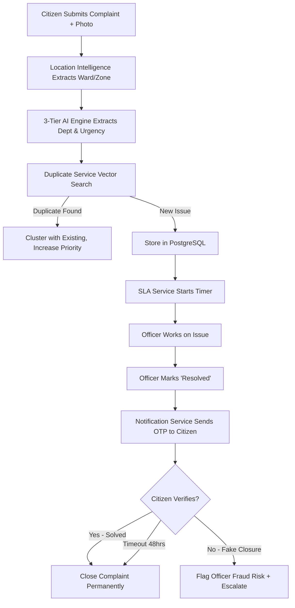

# CivicLens AI: System Architecture & Multi-Agent Flow

## 1. High-Level System Architecture

## 2. Complaint Processing & Anti-Corruption Lifecycle

## 3. Jurisdiction & Routing Intelligence
Complaints are not just routed by category, but further subdivided by geographic location:
- **Electricity**: Subdivided into BSES or NDPL/TPDDL depending on the extracted zone.
- **Municipal**: Subdivided into NDMC, SDMC, EDMC based on coordinates.
