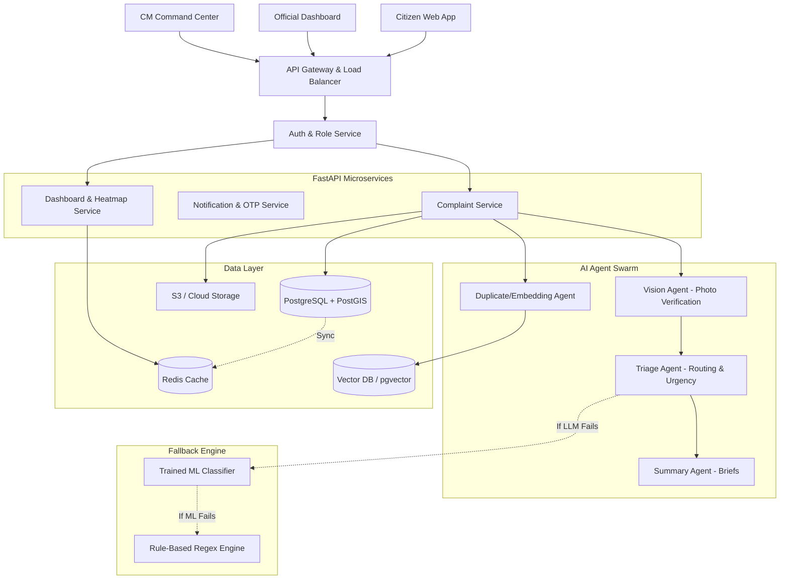

# CivicLens AI: System Architecture & Multi-Agent Flow

## 1. High-Level System Architecture


## 2. Complaint Processing & Anti-Corruption Lifecycle
```mermaid
flowchart TD
    A[Citizen Submits Complaint + Photo] --> B{Photo Valid?}
    B -- Vision AI Checks -->|Fake/Irrelevant| C[Reject / Flag User]
    B -->|Valid| D[Store in DB & S3]
    
    D --> E[Triage Agent: Extracts Dept, Urgency, Region]
    E --> F[Duplicate Agent: Vector Search]
    
    F -->|Duplicate Found| G[Cluster with Existing]
    F -->|New Issue| H[Add to Dept Priority Queue]
    
    H --> I[Official Works on Issue]
    I --> J[Official Marks 'Resolved']
    
    J --> K[Notification Service Sends OTP/Link to Citizen]
    K --> L{Citizen Verifies?}
    
    L -->|Yes - Solved| M[Close Complaint Permanently]
    L -->|No - Fake Closure| N[Reopen + Flag Official + Escalate to CM]
    L -->|Timeout 48hrs| M
```
