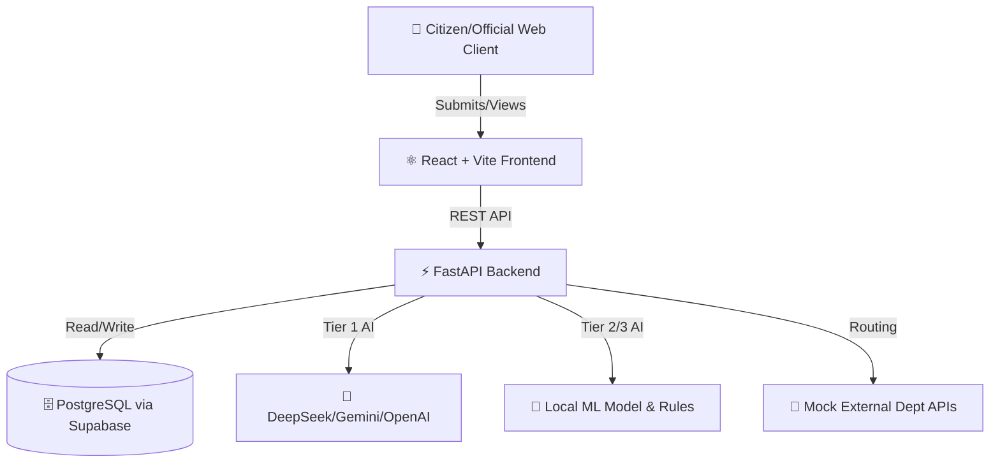
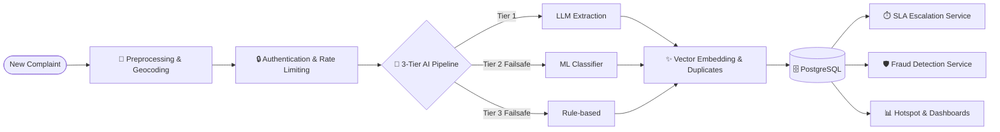

# 🏙️ CivicLens AI

> **AI-Powered Grievance Intelligence Platform for Digital Governance**

CivicLens AI is an enterprise-grade, highly modular platform designed to revolutionize civic grievance management. It leverages a robust 3-Tier AI pipeline, vector-based duplicate detection, fraud prevention, and real-time hotspot clustering to automate the triage and routing of citizen complaints.

---

## ✨ Currently Implemented Features (Core System)

- **🗄️ PostgreSQL + Supabase**: Production-ready database backend.
- **🧠 3-Tier AI Fallback Pipeline**: 
  - **Tier 1**: LLM Routing (Gemini 1.5 Flash / Groq Llama 3 / OpenAI GPT-4o-mini).
  - **Tier 2**: Trained Scikit-Learn ML Model (`CLASSIFIER_MODEL.pkl`).
  - **Tier 3**: Failsafe Rule-Based Regex matching.
- **🛡️ Anti-Corruption / Fraud Detection Loop**: Swiggy-style citizen tracking requires physical OTP verification of closures to prevent fake resolution by officers.
- **🚁 CM Visit Mode (Geolocation)**: Chief Ministers and high-ranking officials can tap "Visit Mode" to use device GPS and instantly pull up unresolved issues in a 2km radius via Haversine proximity.
- **💎 Platinum UI/UX Overhaul**: Built using Framer Motion, Lucide Icons, and Glassmorphism for a "Gov Command Center" aesthetic.
- **📍 Real-Time Hotspot Clustering**: Dynamic geographic clustering of complaints with intensity scoring and trend analysis.
- **🔍 Vector Duplicate Detection**: Identifies identical issues using text embeddings and cosine similarity within geographic radii.
- **🚨 SLA & Escalation Engine**: Automatically bumps complaint status to "ESCALATED" based on urgency-specific SLAs (24h/72h/168h).
- **📊 Dynamic Priority Scoring**: Combines AI urgency, duplicate counts, and category weights to prioritize work queues.
- **🗺️ Location Intelligence**: Advanced geocoding to extract Ward, Zone, District, and Sub-locality automatically.
- **📝 Comprehensive Audit Logging**: Every status change and system action is tracked.

---

## 🏗️ Architecture Diagrams

### 1. High-Level Architecture


### 2. Deep Dive: Backend Pipeline Workflow


---

## 🚀 Getting Started

### Prerequisites
- **Node.js** (v18+)
- **Python** (v3.9+)

### Installation & Running (Windows PowerShell)

**1. Start the Backend (FastAPI)**
```powershell
cd BACKEND
.\.venv\Scripts\python.exe -m uvicorn APP.MAIN:app --host 127.0.0.1 --port 8000
```

**2. Start the Frontend (React + Vite)**
```powershell
cd FRONTEND
npm install
npm run dev
```

---

## 🛠️ Tech Stack

- **Frontend**: React 19, Vite, Recharts, Framer Motion, Lucide React, Space Grotesk
- **Backend**: FastAPI, SQLAlchemy, Uvicorn, Python 3
- **Database**: PostgreSQL (via Supabase)
- **AI/LLM**: Gemini, Groq, OpenAI, Scikit-Learn
- **Mapping**: Leaflet / React-Leaflet