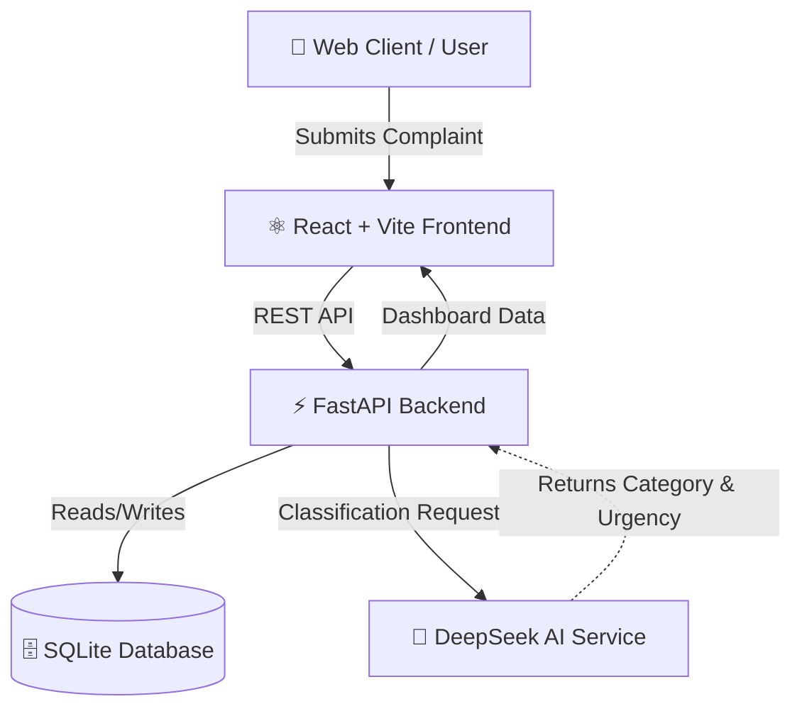
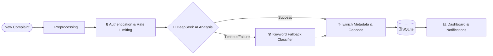
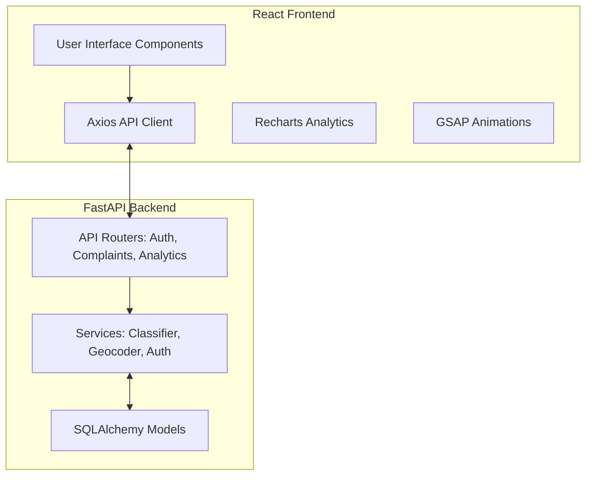

# 🏙️ CivicLens AI

> **AI-Powered Grievance Intelligence Platform for Digital Governance**

CivicLens AI is a comprehensive, scalable, and intelligent platform designed to revolutionize how civic complaints are handled. It leverages advanced AI (DeepSeek) to automatically classify complaints, calculate urgency scores, route issues to the correct municipal departments, and provide actionable analytics through a real-time dashboard.

---

## ✨ Key Features

- **🧠 DeepSeek AI Integration**: Primary decision-maker for hierarchical complaint classification, ensuring accurate categorization with minimal human intervention.
- **⚡ Intelligent Routing**: Automatically assigns complaints to the correct department (e.g., `sewage_department`, `electricity_board`, `road_authority`).
- **🚨 Dynamic Urgency Scoring**: Assesses severity in real-time (from `low` to `critical`) based on key indicators (e.g., accidents, fires, hazards).
- **📊 Real-time Dashboard analytics**: Tracks trends, geographical hot-zones, and departmental performance.
- **🛡️ Fallback Systems**: Reliable keyword-based fallback classification if AI analysis is unavailable or uncertain.
- **📍 Location Intelligence**: Geocodes complaint locations to visualize issues on interactive maps.

---

## 🏗️ Architecture Diagrams

### 1. High-Level Architecture


### 2. Deep Dive: Backend Pipeline Workflow


### 3. Component Architecture


---

## 🚀 Getting Started

### Prerequisites
- **Node.js** (v18+)
- **Python** (v3.9+)

### Installation & Running (Windows PowerShell)

You can run the backend and frontend separately or utilize the provided bash scripts (if using Git Bash or WSL).

**1. Start the Backend (FastAPI)**
```powershell
# Navigate to the BACKEND directory
cd BACKEND

# Activate the virtual environment and start the server
.\.venv\Scripts\python.exe -m uvicorn APP.MAIN:app --host 127.0.0.1 --port 8000
```
*The backend API will be available at `http://127.0.0.1:8000/docs`.*

**2. Start the Frontend (React + Vite)**
```powershell
# Open a new terminal and navigate to the FRONTEND directory
cd FRONTEND

# Install dependencies (if not already done)
npm install

# Start the dev server
npm run dev
```
*The frontend application will be available at `http://localhost:5173`.*

---

## 🛠️ Tech Stack

- **Frontend**: React 19, Vite, Tailwind CSS (assumed), Axios, Recharts, GSAP
- **Backend**: FastAPI, SQLAlchemy, Uvicorn, Python 3
- **Database**: SQLite
- **AI/LLM**: DeepSeek (`deepseek-chat`) for natural language complaint analysis.

---

## 📂 Project Structure
```text
CIVICLENS_AI/
│
├── BACKEND/
│   ├── APP/
│   │   ├── API/            # Route controllers
│   │   ├── CORE/           # Database setup and Configuration
│   │   ├── MODELS/         # SQLAlchemy DB models
│   │   ├── SCHEMAS/        # Pydantic schemas for validation
│   │   ├── SERVICES/       # Business logic (AI, Routing, Emails)
│   │   └── MAIN.py         # FastAPI App Entry point
│   └── requirements.txt
│
├── FRONTEND/
│   ├── src/                # React application code
│   ├── public/             # Static assets
│   ├── package.json
│   └── vite.config.js
│
└── README.md
```

## 🤝 Contributing
Feel free to open issues and pull requests to help improve CivicLens AI!